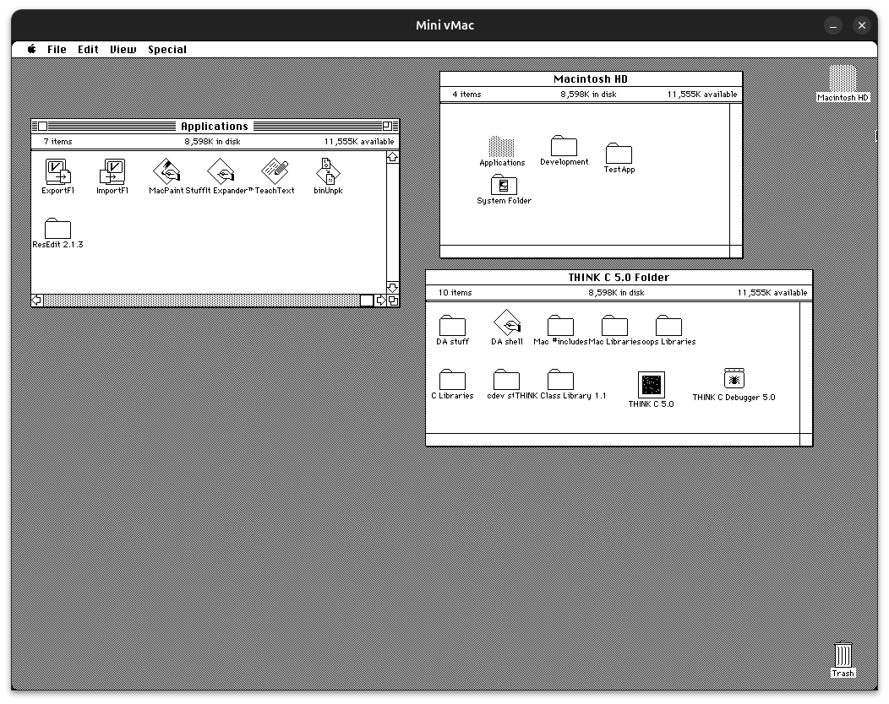

# DevMacSE
An emulated Mac SE for development in Think C using [minivmac](https://www.gryphel.com/c/minivmac/)

## Running
Double click the `Mini vMac` binary or in terminal do `./Mini vMac`. The binary is compiled for Linux operating systems. You can use the [variations service](https://www.gryphel.com/c/minivmac/var_serv.html) to get a binary specific to your platform. Use subscriber code `7084424_7730` to remove the flashing demo marker.

## ROM
You will need to place a Mac SE ROM binary in root folder and name it `MacSE.ROM` they are available [here](https://www.macintoshrepository.org/7038-all-macintosh-roms-68k-ppc-)

## Hard Disk
When the machine boots and you see the flashing disk icon (means there is no bootable device found) just drag and drop `disks/harddisk.dsk` onto the window to boot into Mac System 6.0.8

## Applications
* ExportF1 - export files from the Mac SE
* ImportF1 - import files to the Mac SE
* MacPaint
* Stuffit Expander
* TeachText
* binUnpk - unpack Mac Binary files
* ResEdit 2.1.3
* Think C 5.0 (full install including all C Libraries)

